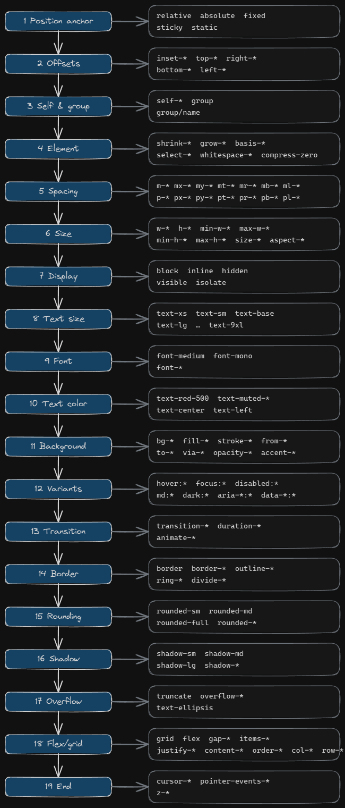

# twaz

Check and automatically fix Tailwind CSS utility class order in JSX/TSX files.

`twaz` enforces a consistent, readable order for `className`, `class`, and `cn()` arguments. It scans source files, reports violations, and reorders classes in place. **Fix mode is enabled by default.**

Built with Go. Distributed on npm with a small Node.js launcher.

- **Repository:** [github.com/maxzz/tw-az](https://github.com/maxzz/tw-az)
- **npm package:** [npmjs.com/package/twaz](https://www.npmjs.com/package/twaz)

## Contents

- [Installation](#installation)
- [Usage](#usage)
  - [CLI](#cli)
  - [Go library](#go-library)
- [Options](#options)
- [What gets scanned](#what-gets-scanned)
- [Tailwind class order rules](#tailwind-class-order-rules)
  - [Precedence overview](#precedence-overview)
  - [Visual order](#visual-order)
  - [Group details](#group-details)
  - [Examples](#examples)
  - [How violations are detected](#how-violations-are-detected)
- [Development](#development)
- [Publishing to npm](#publishing-to-npm)
- [License](#license)

## Installation

```bash
npm install -D twaz
```

Or run without installing:

```bash
npx twaz src
```

## Usage

### CLI

```bash
twaz [options] [paths...]
```

```bash
# Fix class order in the current directory (default)
twaz

# Fix a specific directory or file
twaz src
twaz src/components/Button.tsx

# Report violations only, without changing files
twaz --check src
```

On Windows, the CLI prints a colored report and waits for a key press before closing the window.

### Go library

```go
import "twaz/twaz"

violations := twaz.CheckClassString("bg-muted text-sm absolute")
sorted := twaz.SortClassString("bg-muted text-sm absolute top-0")
result := twaz.RunScan([]string{"src"}, twaz.ScanOptions{Fix: true})
```

## Options

| Option | Short | Default | Description |
|--------|-------|---------|-------------|
| `--fix` | `-f` | **on** | Reorder utility classes automatically in place. This is the default behavior; the flag is kept for explicit use in scripts. |
| `--check` | `-c` | off | Report class order violations only. Does not modify files. Same as `--no-fix`. |
| `--no-fix` | — | off | Alias for `--check`. |
| `--help` | `-h` | off | Show usage, options, and examples. |

**Arguments**

| Argument | Default | Description |
|----------|---------|-------------|
| `paths...` | current directory | One or more files or directories to scan. When a file path is given, its parent folder name is shown in the fix report. |

**Examples**

```bash
twaz src
twaz --check src
twaz src/App.tsx
```

## What gets scanned

By default, `twaz` scans `.tsx` and `.jsx` files. It looks for class strings in:

- `className="..."` / `className='...'`
- `className={`...`}` / `className={"..."}`
- `` className={`... ${expr} ...`} `` — template literals with interpolation (static segments are checked/fixed independently; string literals inside `${...}` ternaries are also extracted)
- `class="..."`
- `cn("...", "...")` / `classNames("...", "...")` — all string literal arguments are checked

Directories `node_modules`, `dist`, and `.git` are skipped.

### Template literal interpolation

When a `className` uses a template literal with `${...}` expressions, `twaz` handles each part separately:

```tsx
className={`h-8 pr-8 ${isInvalid ? 'border-red-500 focus-visible:ring-red-500' : ''}`}
```

- **Static segments** (`h-8 pr-8`) are extracted and checked/sorted as independent class strings.
- **String literals inside interpolation** (`'border-red-500 focus-visible:ring-red-500'`) are also extracted and checked/sorted.
- Non-string expressions and variables inside `${...}` are ignored.

### Multi-argument `cn()` / `classNames()`

All string literal arguments are extracted, not just the first:

```tsx
cn("px-4 h-9", "text-sm font-medium")        // both strings are checked
classNames("mx-5 mt-1 text-xs", className)    // string arg checked, variable ignored
```

## Tailwind class order rules

When writing or editing `className`, `class`, or `cn()` arguments, order utility classes in this sequence. Separate groups with a single space. Keep variant prefixes attached to each utility (e.g. `hover:bg-primary`, not `hover: bg-primary`).

Lower group numbers sort **earlier (left)**. Higher numbers sort **later (right)**. Within the same group, the original relative order is preserved (stable sort).

Unrecognized tokens are ignored for ordering — they do not trigger violations and stay in place during fix.

### Precedence overview

| # | Group | Examples |
|---|-------|----------|
| 1 | Group | `group`, `group/name` |
| 2 | Element | `flex-*`, `shrink-*`, `grow-*`, `self-*`, `justify-self-*`, `place-self-*`, `aspect-*` |
| 3 | Position anchor | `relative`, `absolute`, `fixed`, `sticky`, `static` |
| 4 | Position offsets | `inset-*`, `top-*`, `right-*`, `bottom-*`, `left-*` |
| 5 | Margin & padding | `m-*`, `p-*`, and axis variants |
| 6 | Width & height | `w-*`, `h-*`, `min-*`, `max-*`, `size-*` |
| 7 | Display | `block`, `inline`, `inline-block`, `hidden`, `flow-root`, `contents`, `table`, `float-*`, `clear-*` |
| 8 | Text size | `text-xs`, `text-sm`, `text-base`, `text-lg`, … `text-9xl` |
| 9 | Font | `font-medium`, `font-mono`, `font-*` |
| 10 | Text color | `text-red-500`, `text-muted-foreground`, `text-center` |
| 11 | Background & fill color | `bg-*`, `fill-*`, `stroke-*`, gradients, `opacity-*` |
| 12 | Variant modifiers | `hover:`, `focus:`, `disabled:`, `aria-*:`, `data-*:`, `dark:`, `md:` |
| 13 | Transition | `transition-*`, `duration-*`, `animate-*` |
| 14 | Border | `border`, `border-*`, `outline-*`, `ring-*`, `divide-*` |
| 15 | Rounding | `rounded-*` |
| 16 | Shadow | `shadow-*` |
| 17 | Truncate & overflow | `truncate`, `overflow-*`, `text-ellipsis`, `select-*` |
| 18 | Children (grid & flex) | `flex-row`, `flex-col`, `flex-wrap`, `grid-*`, `flex`, `basis-*`, `items-*`, `justify-*`, `gap-*`, etc. |
| 19 | End | `cursor-*`, `pointer-events-*`, `z-*` (always last) |

### Visual order

Groups are listed top → bottom (1 first, 19 last). In a `className` string, earlier groups sort to the left.

<!-- Export assets/class-order.excalidraw to PNG and place here -->


### Group details

#### 1. Group

`group` · `group/accordion-trigger`

Named groups like `group/accordion-trigger` are recognized as group utilities, not variant prefixes.

#### 2. Element

Flex-child sizing, self-alignment, and element-level behavior — these describe how the element itself behaves inside a flex or grid container.

`flex-*` · `shrink-*` · `grow-*` · `self-*` · `justify-self-*` · `place-self-*` · `aspect-*`

`flex-*` here means child sizing utilities (`flex-1`, `flex-none`, `flex-auto`, `flex-initial`). Container utilities (`flex-row`, `flex-col`, `flex-wrap`) belong to group 18.

#### 3. Position anchor

Positioning mode — before any offset values.

`relative` · `absolute` · `fixed` · `sticky` · `static`

Variant-prefixed anchors (e.g. `md:absolute`) are treated as **variant modifiers** (group 12).

#### 4. Position offsets

`inset-*` · `top-*` · `right-*` · `bottom-*` · `left-*`

#### 5. Margin & padding

**Unprefixed only** — responsive or state-prefixed spacing (e.g. `md:px-4`, `hover:p-2`) is treated as a **variant modifier** (group 12).

`m-*` · `mx-*` · `my-*` · `mt-*` · `mr-*` · `mb-*` · `ml-*` · `p-*` · `px-*` · `py-*` · …

#### 6. Width & height

`w-*` · `h-*` · `min-w-*` · `max-w-*` · `min-h-*` · `max-h-*` · `size-*`

#### 7. Display

`block` · `inline` · `inline-block` · `hidden` · `visible` · `isolate` · `flow-root` · `contents` · `table` · `float-*` · `clear-*`

Variant-prefixed display utilities (e.g. `md:hidden`) sort as **variant modifiers**.

#### 8. Text size

Font size tokens only — not color or alignment.

`text-xs` · `text-sm` · `text-base` · `text-lg` · `text-xl` · `text-2xl` … `text-9xl`

#### 9. Font

`font-medium` · `font-mono` · `font-*`

#### 10. Text color

Text color and text-related non-size utilities. **Unprefixed only.**

`text-red-500` · `text-muted-foreground` · `text-center` · `text-left`

Anything matching `text-*` that is **not** a text size token (group 8) belongs here.

#### 11. Background & fill color

Surface and decorative color. **Unprefixed only.**

`bg-*` · `fill-*` · `stroke-*` · `from-*` · `to-*` · `via-*` · `opacity-*` · `accent-*` · `caret-*` · `decoration-*`

#### 12. Variant modifiers

Any utility with a variant prefix not already placed in an earlier group:

`hover:*` · `focus:*` · `disabled:*` · `aria-*:*` · `data-*:*` · `dark:*` · `md:*` · `lg:*` · `group-hover:*`

- Prefixed margin/padding, display, position, border, rounding, shadow, and children utilities land here.
- Variant-prefixed transition utilities also land here (base `transition-*` without a prefix is group 13).
- The `:` prefix stays attached to the utility name.

#### 13. Transition

Motion and animation for the element itself (unprefixed).

`transition-*` · `duration-*` · `animate-*`

#### 14. Border

Borders, outlines, rings, and dividers. `rounded-*` is excluded (group 15).

`border` · `border-*` · `outline-*` · `ring-*` · `divide-*`

#### 15. Rounding

`rounded-*` · `rounded-sm` · `rounded-md` · `rounded-full`

#### 16. Shadow

`shadow-*` · `shadow-sm` · `shadow-md` · `shadow-lg`

#### 17. Truncate & overflow

Before children layout utilities.

`truncate` · `overflow-*` · `text-ellipsis` · `select-*`

#### 18. Children (grid & flex)

Container layout that affects children. `flex-*` child sizing utilities are in group 2 (element); container utilities stay here.

`flex-row` · `flex-col` · `flex-wrap` · `flex-nowrap` · `grid` · `grid-*` · `inline-grid` · `flex` · `inline-flex` · `basis-*` · `whitespace-*` · `compress-zero` · `items-*` · `justify-*` · `content-*` · `place-items-*` · `place-content-*` · `order-*` · `col-*` · `row-*` · `space-x-*` · `space-y-*` · `list-*` · `gap-*`

Variant-prefixed children utilities (e.g. `md:flex`) sort as **variant modifiers**.

#### 19. End

Interaction and stacking — **always last**.

`cursor-*` · `pointer-events-*` · `z-*`

### Examples

#### Position before offsets; text color before background

```tsx
// ❌ BAD
<div className="top-0 left-0 absolute bg-muted text-sm text-muted-foreground" />

// ✅ GOOD
<div className="absolute top-0 left-0 text-sm text-muted-foreground bg-muted" />
```

#### Font after text size; hover after base color

```tsx
// ❌ BAD
<button className="font-medium text-sm hover:bg-primary flex px-4 h-9 bg-background border rounded-md" />

// ✅ GOOD
<button className="px-4 h-9 text-sm font-medium text-foreground bg-background hover:bg-primary border rounded-md flex" />
```

#### Group near position; z-index last

```tsx
// ❌ BAD
<div className="px-3 py-2 group/accordion-trigger relative z-50 flex cursor-pointer" />

// ✅ GOOD
<div className="relative group/accordion-trigger px-3 py-2 text-sm font-medium text-muted-foreground bg-muted flex cursor-pointer z-50" />
```

#### Overflow before flex children

```tsx
// ❌ BAD
<div className="flex gap-2 overflow-auto truncate w-full" />

// ✅ GOOD
<div className="w-full overflow-auto truncate flex gap-2" />
```

### How violations are detected

`twaz` walks each class string left to right. Each token is classified into a group number. If a token's group number is **lower** than a token that appeared earlier, it is reported as a violation — it should have appeared earlier in the string.

Example: in `bg-muted text-sm absolute`, `text-sm` (group 8) appears after `bg-muted` (group 11), and `absolute` (group 3) appears after `bg-muted` — both are violations.

## Development

```bash
# Run CLI from source
npm run dev

# Go tests
npm test

# Build Windows binary (default)
npm run build

# Build all platform binaries (for npm publish)
npm run build:all
```

## Publishing to npm

1. Log in: `npm login`
2. Build all platform binaries: `npm run build:all`
3. Publish: `npm publish` (or `npm run to-npm`)

`prepublishOnly` runs `build:all` automatically before publish.

## License

MIT — see the `license` field in [package.json](./package.json).
